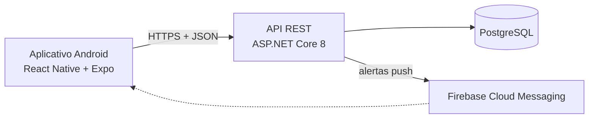

# CoupleSync

Aplicativo Android de gestão financeira compartilhada. Duas ou mais pessoas formam um grupo e passam a ver, no mesmo lugar, os gastos, as rendas e as metas de todos.

O que o diferencia de uma planilha compartilhada é o esforço de registro: uma despesa entra pela **notificação do banco**, capturada no próprio celular, pela **importação do extrato em PDF** ou por um lançamento manual de um campo só.

> Projeto desenvolvido por Lucas Henrique Morais Salomão como Projeto Integrador Transdisciplinar do curso de Engenharia de Software (Universidade Cruzeiro do Sul). A documentação acadêmica completa está em [`docs/pit`](docs/pit/README.md).

## Funcionalidades

- Conta, sessão com renovação automática e grupo com código de convite
- Despesas por captura de notificações (Nubank, Itaú, Inter, C6 e Bradesco), por extrato em PDF e por lançamento manual
- Classificação automática por estabelecimento
- Rendas por membro, individuais ou compartilhadas
- Metas de economia com progresso
- Painel do mês, gastos por categoria, evolução mensal e fluxo de caixa
- Alertas de orçamento, de transação grande e de gasto elevado
- Isolamento completo entre grupos

## Arquitetura



| Parte | Tecnologia | Pasta |
|---|---|---|
| API | C#, .NET 8, ASP.NET Core, Entity Framework Core, FluentValidation | [`backend`](backend/README.md) |
| Aplicativo | TypeScript, React Native 0.76, Expo SDK 52, TanStack Query, Zustand | [`mobile`](mobile/README.md) |
| Banco | PostgreSQL 16 | migrations em `backend/src/CoupleSync.Infrastructure/Migrations` |
| Testes | xUnit (592 testes), Jest (111 testes) | `backend/tests`, `mobile/src/**/__tests__` |
| Entrega | Docker, GitHub Actions, Render, Neon | `backend/Dockerfile`, `.github/workflows`, `render.yaml` |

A API é um monólito modular em quatro projetos (`Domain`, `Application`, `Infrastructure`, `Api`). Os detalhes, a correspondência com o padrão MVC e as decisões estão em [Arquitetura](docs/pit/05-arquitetura.md) e nos [ADRs](docs/adr/README.md).

## Como rodar

Pré-requisito: Docker.

```bash
# 1. Crie o arquivo de ambiente e gere um segredo para os tokens
cp .env.example .env
#    edite .env e troque o valor de JWT__SECRET por um aleatório, por exemplo:
openssl rand -hex 32

# 2. Suba a API e o banco
docker compose up -d --build

# 3. Confira
curl http://localhost:5000/health/ready
```

A API fica em `http://localhost:5000` e aplica as migrations sozinha na primeira execução. Ela se recusa a iniciar sem um `JWT__SECRET` de pelo menos 32 caracteres.

Para criar dados de exemplo (dois usuários, um grupo, despesas e uma meta):

```powershell
pwsh scripts/pilot-seed/seed.ps1 -BaseUrl http://localhost:5000
```

Para rodar o aplicativo apontando para a API local, veja [`mobile/README.md`](mobile/README.md).

## Como testar

```bash
dotnet test backend/CoupleSync.sln      # API: 592 testes, cerca de 1 minuto

cd mobile
npm ci
npm test                                # aplicativo: 111 testes
npx tsc --noEmit                        # verificação de tipos
```

Os testes da API não precisam de banco nem de rede. O plano de testes, a cobertura e a matriz de rastreabilidade estão em [Plano de testes](docs/pit/07-plano-de-testes.md).

## Documentação

| Documento | Conteúdo |
|---|---|
| [Visão e escopo](docs/pit/01-visao-e-escopo.md) | Problema, público, objetivos, o que está dentro e fora |
| [Requisitos](docs/pit/02-requisitos.md) | Requisitos funcionais, regras de negócio e requisitos não funcionais |
| [Casos de uso](docs/pit/03-casos-de-uso.md) | Atores, diagrama e fluxos |
| [Modelagem de dados](docs/pit/04-modelagem-de-dados.md) | Diagrama de classes, DER, projeto físico e dicionário de dados |
| [Arquitetura](docs/pit/05-arquitetura.md) | Camadas, MVC, decisões, segurança e implantação |
| [Interface e experiência](docs/pit/06-ihc-ux.md) | Telas, princípios de interface, acessibilidade e privacidade |
| [Plano de testes](docs/pit/07-plano-de-testes.md) | Verificação e validação, Modelo V, inventário e rastreabilidade |
| [Laudo de qualidade](docs/pit/08-laudo-de-qualidade.md) | Erros encontrados, correções, evidências e pendências |
| [Guia de uso](docs/guia-de-uso.md) | Como usar o aplicativo |
| [Guia de implantação](docs/deployment/DEPLOY-GUIDE.md) | Como publicar a API |

## Limitações conhecidas

O projeto é um piloto acadêmico. As principais limitações, todas detalhadas no [laudo de qualidade](docs/pit/08-laudo-de-qualidade.md):

- Não há como sair de um grupo, remover um membro ou trocar o código de convite.
- Não há recuperação de senha nem confirmação de e-mail.
- A importação de extrato foi validada com o formato do Inter; os leitores de outros bancos falham com vários lançamentos por página.
- O aplicativo não tem tela de consentimento nem política de privacidade para a captura de notificações, exigidas para distribuição a público real.
- No plano gratuito de hospedagem, a API suspende após 15 minutos sem uso e leva cerca de um minuto para responder à primeira requisição seguinte.

## Uso de inteligência artificial no desenvolvimento

Este projeto foi desenvolvido com assistência de ferramentas de IA para programação (GitHub Copilot e Claude Code), o que está registrado no histórico de commits. A definição do produto, as decisões de arquitetura, a revisão do código e a responsabilidade pelo resultado são do autor. As instruções usadas com os agentes de IA estão em `.github/agents` e `.github/instructions`.

A revisão de qualidade descrita no laudo também usou IA como ferramenta de inspeção de código e de execução dos roteiros de teste; cada achado citado foi reproduzido no sistema e cada correção tem um teste automatizado que falhava antes e passa depois.
