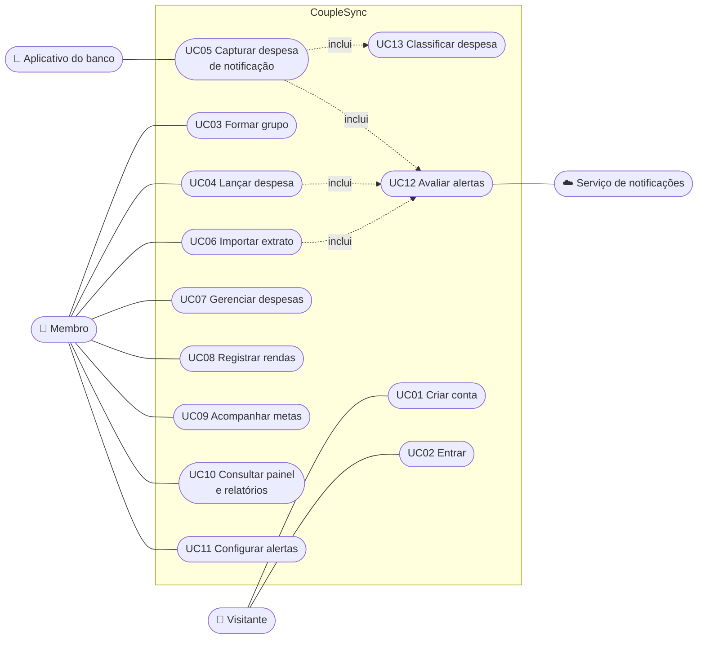

# 3. Casos de uso

## 3.1 Atores

| Ator | Descrição |
|---|---|
| **Visitante** | Pessoa que ainda não se identificou no aplicativo |
| **Membro** | Usuário identificado que pertence a um grupo. Todos os membros têm o mesmo acesso |
| **Aplicativo do banco** | Ator externo: emite a notificação de compra que o CoupleSync captura no celular do membro |
| **Serviço de notificações** | Ator externo (Firebase Cloud Messaging): entrega os alertas ao celular |

## 3.2 Diagrama de casos de uso

| Caso de uso | Requisitos atendidos |
|---|---|
| UC01 Criar conta | RF01 |
| UC02 Entrar | RF02, RF03 |
| UC03 Formar grupo | RF04, RF05, RF06 |
| UC04 Lançar despesa | RF10 |
| UC05 Capturar despesa de notificação | RF11, RF17 |
| UC06 Importar extrato | RF12, RF13 |
| UC07 Gerenciar despesas | RF14, RF15, RF16 |
| UC08 Registrar rendas | RF23, RF24 |
| UC09 Acompanhar metas | RF30 a RF33 |
| UC10 Consultar painel e relatórios | RF40 a RF43 |
| UC11 Configurar alertas | RF53, RF54 |
| UC12 Avaliar alertas | RF50, RF51, RF52 |
| UC13 Classificar despesa | RF17 |

A seguir, a descrição dos seis casos de uso centrais.

## 3.3 UC03 — Formar grupo

| | |
|---|---|
| **Objetivo** | Dois ou mais usuários passam a compartilhar os mesmos dados financeiros |
| **Ator** | Membro (ainda sem grupo) |
| **Pré-condição** | O usuário está identificado e não pertence a nenhum grupo |
| **Pós-condição** | O usuário pertence a um grupo e sua sessão passa a carregar a identificação do grupo |

**Fluxo principal — criar um grupo**

1. O usuário escolhe "Criar".
2. O sistema cria o grupo, gera um código de convite de seis caracteres e inclui o usuário como primeiro membro.
3. O sistema emite um novo token de acesso, agora com a identificação do grupo.
4. O aplicativo mostra o código, com um botão para copiá-lo.
5. O usuário envia o código a quem quer convidar, por qualquer meio.

**Fluxo alternativo — entrar em um grupo**

1. O usuário escolhe "Entrar" e digita o código recebido.
2. O sistema localiza o grupo pelo código (sem diferenciar maiúsculas de minúsculas) e inclui o usuário como membro.
3. O sistema emite um novo token de acesso com a identificação do grupo.
4. O sistema registra um aviso ao criador do grupo de que alguém entrou.

**Exceções**

| Situação | Resposta do sistema |
|---|---|
| Código inexistente | 404, "grupo não encontrado" |
| Código com formato inválido | 400 |
| O usuário já pertence a um grupo | 409 |
| Mais de 5 tentativas de entrada em um minuto | 429, com o tempo de espera |

**Regras:** RN03, RN04. **Limitação conhecida:** não há como sair do grupo nem trocar o código.

## 3.4 UC04 — Lançar despesa

| | |
|---|---|
| **Objetivo** | Registrar um gasto que não passou por um banco suportado |
| **Ator** | Membro |
| **Pré-condição** | O usuário pertence a um grupo |
| **Pós-condição** | A despesa existe e é visível a todos os membros; os alertas aplicáveis foram gerados |

**Fluxo principal**

1. O usuário abre "Nova transação".
2. O aplicativo mostra o formulário com uma categoria já selecionada.
3. O usuário informa o valor e, se quiser, descrição, estabelecimento e outra categoria.
4. O usuário confirma.
5. O sistema valida os dados, grava a despesa com a data e a hora atuais e com o usuário como autor.
6. O sistema avalia os alertas (UC12).
7. O aplicativo volta à lista, que já mostra a nova despesa, e atualiza o painel.

**Exceções**

| Situação | Resposta do sistema |
|---|---|
| Valor zero, negativo ou acima do limite | 400, com o campo indicado |
| Categoria vazia ou com mais de 64 caracteres; descrição com mais de 512 | 400 |
| Sessão expirada | O aplicativo renova a sessão e repete o envio, sem que o usuário perceba |
| Sem conexão | O aplicativo mostra uma mensagem de erro e a despesa não é gravada |

**Regras:** RN01, RN09, RN17.

## 3.5 UC05 — Capturar despesa de notificação

| | |
|---|---|
| **Objetivo** | Registrar uma compra sem que o usuário digite nada |
| **Atores** | Aplicativo do banco (inicia); Membro (autoriza previamente) |
| **Pré-condição** | O usuário concedeu ao CoupleSync a permissão de acesso a notificações do Android e está identificado |
| **Pós-condição** | A despesa existe no grupo, com categoria sugerida, ou a notificação foi descartada |

**Fluxo principal**

1. O aplicativo do banco exibe uma notificação de compra no celular.
2. O serviço de captura verifica o aplicativo de origem. Se não for um dos bancos suportados, descarta.
3. O aplicativo interpreta o texto com os padrões daquele banco e extrai valor e estabelecimento.
4. O aplicativo envia ao servidor o banco, o valor, a moeda, a data e a hora e o estabelecimento.
5. O sistema calcula a impressão digital do evento e verifica se a despesa já existe no grupo.
6. O sistema sugere a categoria pelo nome do estabelecimento (UC13) e grava a despesa.
7. O sistema avalia os alertas (UC12).

**Fluxos alternativos**

| Situação | O que acontece |
|---|---|
| A notificação é de recebimento, estorno, fatura, limite ou propaganda | O aplicativo descarta no passo 3; nada é enviado |
| O texto não casa com nenhum padrão de compra | O aplicativo descarta; nada é enviado |
| A despesa já existe (o mesmo evento chegou duas vezes) | O sistema registra a entrada como duplicada e não cria outra despesa |
| Nenhuma regra de categoria casa com o estabelecimento | A despesa é gravada na categoria "Outros" |
| Sem conexão no momento | O aplicativo guarda o evento em memória e tenta de novo |

**Regras:** RN07, RN08, RNF16.

## 3.6 UC06 — Importar extrato

| | |
|---|---|
| **Objetivo** | Registrar de uma vez as despesas de um extrato ou fatura em PDF |
| **Ator** | Membro |
| **Pré-condição** | O usuário pertence a um grupo e tem o PDF no celular |
| **Pós-condição** | Os lançamentos escolhidos viraram despesas do grupo; a importação está concluída |

**Fluxo principal**

1. O usuário abre "Importar extrato" e escolhe um arquivo PDF.
2. O aplicativo envia o arquivo. O sistema confere tamanho e tipo, guarda o arquivo e registra a importação como pendente.
3. Uma tarefa em segundo plano extrai o texto do PDF, identifica o banco e lê os lançamentos de débito.
4. O sistema calcula a impressão digital de cada lançamento, marca os que já existem no grupo como possível repetição e apaga o arquivo.
5. O aplicativo, que vinha consultando o andamento, abre a tela de revisão.
6. O usuário confere a lista. Pode desmarcar lançamentos e corrigir descrição, valor e categoria.
7. O usuário confirma.
8. O sistema grava uma despesa para cada lançamento selecionado, aplicando as correções, ignora os que já existem e conclui a importação.
9. O sistema avalia os alertas (UC12).
10. O aplicativo informa quantas despesas foram criadas e volta à lista.

**Exceções**

| Situação | Resposta do sistema |
|---|---|
| Arquivo com mais de 10 MB | Recusado no envio |
| Arquivo que não é PDF | Recusado no aplicativo antes do envio, e no servidor pela verificação do conteúdo |
| PDF protegido por senha | A importação falha com o código `PDF_ENCRYPTED`; o aplicativo orienta a exportar sem senha |
| PDF sem texto (digitalizado) | Falha com `PDF_TOO_SHORT` |
| Banco não reconhecido | Falha com `BANK_FORMAT_UNKNOWN`, na primeira tentativa |
| Seleção com índice que não existe | 422; a importação continua disponível para nova tentativa |
| Correção inválida (descrição vazia, valor zero) | O aplicativo destaca a linha e não envia; o servidor também recusa com 400 |
| A importação já foi confirmada | 409 |
| Todos os lançamentos já existiam | Nenhuma despesa é criada; o sistema informa quantos foram ignorados e conclui a importação |

**Regras:** RN07, RN10, RN11, RN18. **Limitação conhecida:** o leitor foi validado com o formato do Inter; os de outros bancos erram quando há vários lançamentos por página.

## 3.7 UC09 — Acompanhar metas

| | |
|---|---|
| **Objetivo** | O grupo define um objetivo de economia e acompanha quanto falta |
| **Ator** | Membro |
| **Pré-condição** | O usuário pertence a um grupo |
| **Pós-condição** | A meta existe, com o valor guardado atualizado |

**Fluxo principal**

1. O usuário abre "Metas" e vê as metas ativas do grupo, cada uma com valor guardado, valor-alvo, percentual e prazo.
2. O usuário cria uma meta informando título, valor-alvo e prazo.
3. Mais tarde, qualquer membro abre a meta e atualiza o valor guardado.
4. O sistema grava e a barra de progresso reflete o novo valor.

**Fluxos alternativos**

| Situação | O que acontece |
|---|---|
| O valor guardado passa do alvo | O percentual exibido fica em 100% e a meta é marcada como atingida |
| O grupo desiste da meta | Um membro arquiva (a meta some da lista e não pode mais ser editada) ou exclui, após confirmar |

**Exceções**

| Situação | Resposta do sistema |
|---|---|
| Valor-alvo zero ou negativo; título vazio ou com mais de 128 caracteres | 400 |
| Prazo anterior a hoje | 400 |
| Edição de meta arquivada | 409 |
| Meta de outro grupo | 404 |

**Regras:** RN14, RN15, RN16.

## 3.8 UC12 — Avaliar alertas

| | |
|---|---|
| **Objetivo** | Avisar o membro quando um gasto merece atenção |
| **Ator** | Sistema (acionado por UC04, UC05 e UC06); Serviço de notificações (entrega) |
| **Pré-condição** | Uma despesa acabou de ser gravada |
| **Pós-condição** | Os alertas aplicáveis estão registrados e na fila de envio |

**Fluxo principal**

1. O sistema lê as preferências de alerta de quem lançou a despesa. Se não houver preferência gravada, considera todos os alertas ligados.
2. Se a despesa passa de R$ 500, registra um alerta de transação grande.
3. Se existe orçamento para a categoria no mês, soma o gasto da categoria: ao cruzar 80% do planejado, registra um aviso; ao ultrapassar 100%, registra um alerta de orçamento estourado. Cada um é registrado uma vez por categoria no mês.
4. Se o gasto do grupo nos últimos 30 dias passa de R$ 3.000, registra um alerta de gasto elevado.
5. Uma tarefa em segundo plano envia cada alerta pendente ao Serviço de notificações, que o entrega aos aparelhos registrados do usuário.

**Exceções**

| Situação | O que acontece |
|---|---|
| Falha ao avaliar ou registrar um alerta | A falha é registrada em log; a despesa permanece gravada |
| O usuário não tem aparelho registrado, ou o envio falha | O alerta é marcado como não entregue |
| O tipo de alerta está desligado nas preferências | Nenhum alerta daquele tipo é registrado |

**Regras:** RN17. **Limitações conhecidas:** o alerta de gasto elevado se repete a cada nova despesa depois do limite; os alertas vão só para quem lançou a despesa, não para os demais membros.
