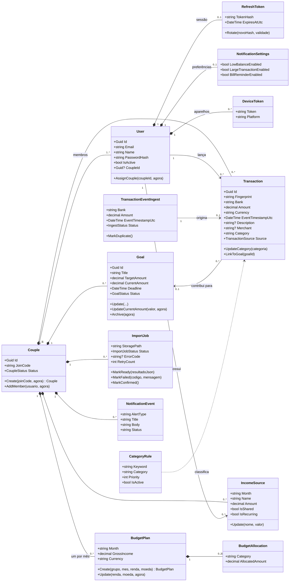
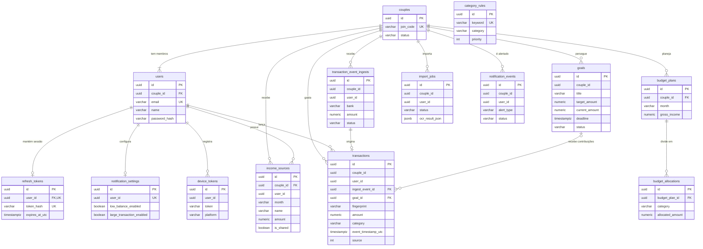

# 4. Modelagem de dados

Este documento descreve o modelo de dados do CoupleSync em três níveis: o modelo conceitual (diagrama de classes UML), o modelo lógico (diagrama entidade-relacionamento) e o projeto físico (tabelas do PostgreSQL, com o domínio de cada atributo e as restrições de integridade).

Tudo aqui foi extraído do sistema em execução: as classes vêm de `backend/src/CoupleSync.Domain/Entities`, e o projeto físico vem do esquema que as 13 migrations do EF Core criam em um PostgreSQL 16 (consultado com `information_schema` e `pg_constraint`).

> **Sobre os nomes.** No código e no banco a unidade de compartilhamento se chama `Couple` (casal). O sistema permite, por decisão de projeto, que um grupo tenha mais de dois membros (uma família, por exemplo), então neste documento "grupo" e "casal" designam a mesma entidade.

## 4.1 Modelo conceitual — diagrama de classes

O diagrama mostra as entidades de negócio, seus atributos descritivos e as operações que protegem as regras de cada uma. Atributos de auditoria (`CreatedAtUtc`, `UpdatedAtUtc`) foram omitidos para manter a leitura.



### Descrição das classes

| Classe | O que representa no negócio |
|---|---|
| **Couple** | O grupo que compartilha as finanças. Tem um código de convite; quem informa o código passa a ser membro. É a fronteira de isolamento: nenhum dado de um grupo é visível a outro. |
| **User** | Uma pessoa com conta no sistema. Pertence a no máximo um grupo. |
| **RefreshToken** | A sessão longa do usuário. Guarda só o hash do token; é trocado a cada renovação. |
| **Transaction** | Uma despesa do grupo. Pode nascer de um lançamento manual, de uma notificação bancária capturada no celular ou da importação de um extrato. |
| **TransactionEventIngest** | O registro de entrada de um evento financeiro antes de virar transação. Guarda o resultado da entrada: aceito, duplicado ou rejeitado. |
| **Goal** | Uma meta de economia do grupo, com valor-alvo e prazo. Transações podem ser vinculadas a ela. |
| **BudgetPlan** | O orçamento do grupo em um mês: a renda prevista e quanto se pretende gastar por categoria. |
| **BudgetAllocation** | O limite de gasto de uma categoria dentro de um plano. |
| **IncomeSource** | Uma fonte de renda de um membro em um mês, individual ou compartilhada com o grupo. |
| **ImportJob** | Uma importação de extrato em PDF: o arquivo enviado, o andamento do processamento e os lançamentos encontrados. |
| **NotificationSettings** | Quais alertas o usuário quer receber. |
| **NotificationEvent** | Um alerta gerado pelo sistema para um usuário (orçamento estourado, transação grande) e a situação da entrega. |
| **DeviceToken** | O identificador de um aparelho para envio de notificações push. |
| **CategoryRule** | Uma regra de classificação automática: se o nome do estabelecimento contém a palavra-chave, a transação recebe a categoria. |

### Enumerações

| Enumeração | Valores |
|---|---|
| `CoupleStatus` | `Active`, `Dissolved` (previsto; ainda sem uso) |
| `GoalStatus` | `Active`, `Archived` |
| `IngestStatus` | `Accepted`, `Rejected`, `Duplicate` |
| `ImportJobStatus` | `Pending`, `Processing`, `Ready`, `Failed`, `Confirmed` |
| `TransactionSource` | `Manual` (0), `OcrImport` (1), `Notification` (2) |

## 4.2 Modelo lógico — diagrama entidade-relacionamento



### Cardinalidades e como cada uma é garantida

O diagrama acima mostra os relacionamentos do negócio. Nem todos são garantidos por chave estrangeira no banco: o projeto optou por garantir o vínculo com o grupo na aplicação, e essa diferença precisa estar explícita.

| Relacionamento | Cardinalidade | Garantido por |
|---|---|---|
| `users.couple_id` → `couples.id` | N:1, opcional | **Chave estrangeira** (`ON DELETE RESTRICT`) |
| `refresh_tokens.user_id` → `users.id` | 1:1 | **Chave estrangeira** (`ON DELETE CASCADE`) + índice único em `user_id` |
| `budget_plans.couple_id` → `couples.id` | N:1 | **Chave estrangeira** (`RESTRICT`) + índice único `(couple_id, month)`: um plano por grupo por mês |
| `budget_allocations.budget_plan_id` → `budget_plans.id` | N:1 | **Chave estrangeira** (`CASCADE`): apagar o plano apaga as alocações |
| `income_sources.couple_id` → `couples.id` | N:1 | **Chave estrangeira** (`RESTRICT`) |
| `transactions.ingest_event_id` → `transaction_event_ingests.id` | 1:1 | **Chave estrangeira** (`RESTRICT`) |
| `transactions.goal_id` → `goals.id` | N:1, opcional | **Chave estrangeira** (`ON DELETE SET NULL`): apagar a meta desvincula as transações |
| `couple_id` em `transactions`, `goals`, `transaction_event_ingests`, `import_jobs`, `notification_events`, `notification_settings`, `device_tokens` | N:1 | **Aplicação**: o identificador do grupo vem do token de acesso, toda entidade implementa `ICoupleScoped` e um filtro global do EF Core restringe as consultas ao grupo |
| `user_id` em `transactions`, `income_sources`, `import_jobs`, `notification_events`, `notification_settings`, `device_tokens` | N:1 | **Aplicação**: o identificador do usuário vem do token de acesso |

A ausência de chave estrangeira nas duas últimas linhas é uma limitação conhecida, registrada no laudo de qualidade: a integridade é mantida enquanto todo acesso passar pela API, mas o banco não impediria uma inserção direta com um `couple_id` inexistente.

## 4.3 Mapeamento do modelo de classes para o modelo relacional

| Elemento do modelo de classes | Elemento relacional | Regra aplicada |
|---|---|---|
| Classe (`Transaction`) | Tabela (`transactions`) | Uma tabela por classe; nomes em `snake_case` no plural |
| Atributo (`EventTimestampUtc`) | Coluna (`event_timestamp_utc`) | Uma coluna por atributo |
| Identidade do objeto (`Id : Guid`) | Chave primária `uuid` | Gerada pela aplicação, não pelo banco |
| Associação N:1 (`User` → `Couple`) | Coluna de chave estrangeira no lado N (`users.couple_id`) | |
| Composição (`BudgetPlan` *-- `BudgetAllocation`) | Chave estrangeira com `ON DELETE CASCADE` | A parte não existe sem o todo |
| Associação opcional (`Transaction` → `Goal`) | Chave estrangeira anulável com `ON DELETE SET NULL` | |
| Enumeração (`GoalStatus`) | `varchar(16)` com o nome do valor | Conversão `HasConversion<string>()`; legível em consultas |
| Enumeração (`TransactionSource`) | `integer` | Exceção histórica: foi adicionada depois, com padrão `0` (manual) para as linhas existentes |
| Objeto de valor (`EmailAddress`) | Coluna `varchar(254)` | Validado e normalizado para minúsculas antes de gravar |
| Coleção de lançamentos lidos de um extrato | Coluna `jsonb` (`import_jobs.ocr_result_json`) | Dado transitório, lido e gravado inteiro; não justifica tabela própria |
| Métodos (`Goal.Archive`) | Não têm equivalente relacional | As regras ficam na aplicação; não há procedimentos armazenados |

## 4.4 Projeto físico e dicionário de dados

SGBD: PostgreSQL 16. Convenções comuns a todas as tabelas:

- Chave primária `id uuid`, gerada pela aplicação.
- Valores monetários em `numeric(18,2)`. Nunca ponto flutuante.
- Moeda em `varchar(3)` (código ISO 4217, ex.: `BRL`).
- Datas e horas em `timestamp with time zone`, sempre gravadas em UTC.
- Mês de competência em `varchar(7)`, no formato `AAAA-MM`.

Na coluna **Domínio**, o que está descrito é o conjunto de valores válidos, não só o tipo. Onde a regra é imposta pela aplicação e não por uma restrição do banco, isso está indicado com *(aplicação)*.

### `couples` — grupos

| Coluna | Tipo | Obrig. | Domínio e restrições |
|---|---|---|---|
| `id` | uuid | sim | PK |
| `join_code` | varchar(6) | sim | 6 caracteres de `A–Z` e `0–9`, gerados com gerador criptográfico. **Único** |
| `status` | varchar(16) | sim | `Active` ou `Dissolved` *(aplicação)* |
| `created_at` | timestamptz | sim | Instante da criação |

### `users` — usuários

| Coluna | Tipo | Obrig. | Domínio e restrições |
|---|---|---|---|
| `id` | uuid | sim | PK |
| `couple_id` | uuid | não | FK → `couples.id` (`RESTRICT`). Nulo enquanto o usuário não entra em um grupo |
| `email` | varchar(254) | sim | Endereço de e-mail válido, em minúsculas. **Único** |
| `name` | varchar(120) | sim | Nome de exibição, não vazio |
| `password_hash` | varchar(255) | sim | Hash bcrypt (custo 11) da senha. A senha em si nunca é gravada |
| `is_active` | boolean | sim | |
| `couple_joined_at_utc` | timestamptz | não | Preenchido junto com `couple_id` |
| `created_at_utc` | timestamptz | sim | |

### `refresh_tokens` — sessões

| Coluna | Tipo | Obrig. | Domínio e restrições |
|---|---|---|---|
| `id` | uuid | sim | PK |
| `user_id` | uuid | sim | FK → `users.id` (`CASCADE`). **Único**: uma sessão por usuário |
| `token_hash` | varchar(64) | sim | SHA-256 do token, em hexadecimal. **Único** |
| `expires_at_utc` | timestamptz | sim | Criação + 7 dias |
| `created_at_utc`, `updated_at_utc` | timestamptz | sim | |

### `transactions` — despesas

| Coluna | Tipo | Obrig. | Domínio e restrições |
|---|---|---|---|
| `id` | uuid | sim | PK |
| `couple_id` | uuid | sim | Grupo dono do lançamento *(aplicação)* |
| `user_id` | uuid | sim | Membro que lançou *(aplicação)* |
| `fingerprint` | varchar(64) | sim | SHA-256 dos dados que identificam o lançamento. **Único por grupo** (`couple_id, fingerprint`): impede a mesma despesa duas vezes |
| `bank` | varchar(64) | sim | Banco de origem, ou `MANUAL`, ou `OCR Import` |
| `amount` | numeric(18,2) | sim | Maior que zero *(aplicação)* |
| `currency` | varchar(3) | sim | Código ISO; padrão `BRL` |
| `event_timestamp_utc` | timestamptz | sim | Quando a despesa ocorreu |
| `description` | varchar(512) | não | |
| `merchant` | varchar(512) | não | Estabelecimento |
| `category` | varchar(64) | sim | Texto não vazio |
| `ingest_event_id` | uuid | sim | FK → `transaction_event_ingests.id` (`RESTRICT`) |
| `goal_id` | uuid | não | FK → `goals.id` (`SET NULL`) |
| `source` | integer | sim | `0` manual, `1` importação de extrato, `2` notificação. Padrão `0` |
| `created_at_utc` | timestamptz | sim | |

Índices: `(couple_id, event_timestamp_utc)` para listagem por período; `(couple_id, category)` para totais por categoria; `goal_id`; `ingest_event_id`.

### `transaction_event_ingests` — eventos de entrada

| Coluna | Tipo | Obrig. | Domínio e restrições |
|---|---|---|---|
| `id` | uuid | sim | PK |
| `couple_id`, `user_id` | uuid | sim | *(aplicação)* |
| `bank` | varchar(64) | sim | Banco suportado, ou `MANUAL`, ou `OCR` |
| `amount` | numeric(18,2) | sim | Maior que zero *(aplicação)* |
| `currency` | varchar(3) | sim | |
| `event_timestamp_utc` | timestamptz | sim | Não pode estar no futuro *(aplicação)* |
| `description`, `merchant` | varchar(512) | não | |
| `raw_notification_text_redacted` | varchar(512) | não | Ver seção de privacidade em [IHC e UX](06-ihc-ux.md) |
| `status` | varchar(16) | sim | `Accepted`, `Rejected` ou `Duplicate` *(aplicação)* |
| `error_message` | varchar(512) | não | |
| `created_at_utc` | timestamptz | sim | |

### `goals` — metas

| Coluna | Tipo | Obrig. | Domínio e restrições |
|---|---|---|---|
| `id` | uuid | sim | PK |
| `couple_id`, `created_by_user_id` | uuid | sim | *(aplicação)* |
| `title` | varchar(128) | sim | Não vazio |
| `description` | varchar(512) | não | |
| `target_amount` | numeric(18,2) | sim | Maior que zero *(aplicação)* |
| `current_amount` | numeric(18,2) | sim | Maior ou igual a zero *(aplicação)*. Padrão `0` |
| `currency` | varchar(3) | sim | |
| `deadline` | timestamptz | sim | Hoje ou data futura, na criação *(aplicação)* |
| `status` | varchar(16) | sim | `Active` ou `Archived` *(aplicação)* |
| `created_at_utc`, `updated_at_utc` | timestamptz | sim | |

### `budget_plans` e `budget_allocations` — orçamento

| Tabela.Coluna | Tipo | Obrig. | Domínio e restrições |
|---|---|---|---|
| `budget_plans.id` | uuid | sim | PK |
| `budget_plans.couple_id` | uuid | sim | FK → `couples.id` (`RESTRICT`) |
| `budget_plans.month` | varchar(7) | sim | `AAAA-MM`, mês de 01 a 12 *(aplicação)*. **Único por grupo** (`couple_id, month`) |
| `budget_plans.gross_income` | numeric(18,2) | sim | Maior ou igual a zero *(aplicação)* |
| `budget_plans.currency` | varchar(3) | sim | |
| `budget_allocations.id` | uuid | sim | PK |
| `budget_allocations.budget_plan_id` | uuid | sim | FK → `budget_plans.id` (`CASCADE`) |
| `budget_allocations.category` | varchar(64) | sim | Não vazia; sem repetição dentro do plano, ignorando maiúsculas *(aplicação)* |
| `budget_allocations.allocated_amount` | numeric(18,2) | sim | Maior ou igual a zero *(aplicação)* |
| `budget_allocations.currency` | varchar(3) | sim | Igual à moeda do plano *(aplicação)* |

Regra de negócio: no máximo 20 alocações por plano *(aplicação)*.

### `income_sources` — fontes de renda

| Coluna | Tipo | Obrig. | Domínio e restrições |
|---|---|---|---|
| `id` | uuid | sim | PK |
| `couple_id` | uuid | sim | FK → `couples.id` (`RESTRICT`) |
| `user_id` | uuid | sim | Dono da renda *(aplicação)* |
| `month` | varchar(7) | sim | `AAAA-MM` |
| `name` | varchar(64) | sim | Não vazio. **Único** por `(couple_id, user_id, month, name)` |
| `amount` | numeric(18,2) | sim | Maior ou igual a zero *(aplicação)* |
| `currency` | varchar(3) | sim | |
| `is_shared` | boolean | sim | Renda compartilhada pode ser editada por qualquer membro do grupo |
| `is_recurring` | boolean | sim | Padrão `false` |
| `created_at_utc`, `updated_at_utc` | timestamptz | sim | |

### `import_jobs` — importações de extrato

| Coluna | Tipo | Obrig. | Domínio e restrições |
|---|---|---|---|
| `id` | uuid | sim | PK |
| `couple_id`, `user_id` | uuid | sim | *(aplicação)* |
| `storage_path` | varchar(1024) | sim | `uploads/<grupo>/<guid>.pdf`; nome gerado pelo servidor |
| `file_mime_type` | varchar(128) | sim | Tipo detectado pelo conteúdo do arquivo |
| `status` | varchar(16) | sim | `Pending`, `Processing`, `Ready`, `Failed` ou `Confirmed` *(aplicação)* |
| `ocr_result_json` | jsonb | não | Lançamentos encontrados; preenchido em `Ready` |
| `error_code` | varchar(64) | não | Ex.: `PDF_ENCRYPTED`, `PDF_TOO_SHORT`, `BANK_FORMAT_UNKNOWN` |
| `error_message` | varchar(512) | não | |
| `quota_reset_date` | timestamptz | não | Usado só com provedor externo de OCR |
| `retry_count` | integer | sim | Padrão `0` |
| `created_at_utc`, `updated_at_utc` | timestamptz | sim | |

### `notification_settings`, `notification_events`, `device_tokens` — alertas

| Tabela.Coluna | Tipo | Obrig. | Domínio e restrições |
|---|---|---|---|
| `notification_settings.user_id` | uuid | sim | **Único**: uma linha por usuário |
| `notification_settings.low_balance_enabled`, `large_transaction_enabled`, `bill_reminder_enabled` | boolean | sim | Ligados por padrão |
| `notification_events.alert_type` | varchar(128) | sim | Ex.: `BudgetWarning`, `BudgetExceeded`, `LargeTransaction`, `LowBalance`, `PartnerJoined` |
| `notification_events.title` | varchar(128) | sim | |
| `notification_events.body` | varchar(512) | sim | |
| `notification_events.status` | varchar(16) | sim | `Pending`, `Delivered` ou `Failed` *(aplicação)* |
| `notification_events.delivered_at_utc` | timestamptz | não | |
| `device_tokens.token` | varchar(512) | sim | Token do Firebase Cloud Messaging |
| `device_tokens.platform` | varchar(16) | sim | `android` *(aplicação)*. **Único** por `(user_id, platform)` |
| `device_tokens.last_seen_at_utc` | timestamptz | sim | |

As três tabelas têm `id` (PK), `user_id` e `couple_id` *(aplicação)*.

### `category_rules` — regras de classificação

| Coluna | Tipo | Obrig. | Domínio e restrições |
|---|---|---|---|
| `id` | uuid | sim | PK |
| `keyword` | varchar(128) | sim | Palavra procurada no nome do estabelecimento. **Única** |
| `category` | varchar(64) | sim | `Alimentação`, `Transporte`, `Moradia`, `Saúde`, `Lazer` ou `Compras` |
| `priority` | integer | sim | Regras de maior prioridade são avaliadas primeiro |
| `is_active` | boolean | sim | |

Tabela de referência, carregada na primeira execução com 38 regras (`Persistence/Seeders/category-rules.json`). Não pertence a nenhum grupo.

### Exemplo do DDL gerado

Trecho do esquema criado pelas migrations (saída de `pg_dump --schema-only`):

```sql
CREATE TABLE public.transactions (
    id uuid NOT NULL,
    couple_id uuid NOT NULL,
    user_id uuid NOT NULL,
    fingerprint character varying(64) NOT NULL,
    bank character varying(64) NOT NULL,
    amount numeric(18,2) NOT NULL,
    currency character varying(3) NOT NULL,
    event_timestamp_utc timestamp with time zone NOT NULL,
    description character varying(512),
    merchant character varying(512),
    category character varying(64) NOT NULL,
    ingest_event_id uuid NOT NULL,
    created_at_utc timestamp with time zone NOT NULL,
    goal_id uuid,
    source integer DEFAULT 0 NOT NULL
);

ALTER TABLE ONLY public.transactions
    ADD CONSTRAINT "PK_transactions" PRIMARY KEY (id);

CREATE UNIQUE INDEX "IX_transactions_couple_id_fingerprint"
    ON public.transactions USING btree (couple_id, fingerprint);

ALTER TABLE ONLY public.transactions
    ADD CONSTRAINT "FK_transactions_goals_goal_id"
    FOREIGN KEY (goal_id) REFERENCES public.goals(id) ON DELETE SET NULL;
```

O esquema completo é reproduzível com `dotnet ef migrations script` a partir de `backend/src/CoupleSync.Infrastructure`.

## 4.5 Como a qualidade dos dados é garantida

O material da disciplina lista os riscos de um sistema sem modelagem de dados. A tabela mostra o que este projeto faz contra cada um.

| Risco | O que o modelo faz |
|---|---|
| **Redundância** | Cada fato tem um único lugar. O total gasto em uma categoria não é guardado: é calculado das transações. A única redundância assumida é `goals.current_amount`, valor informado à mão que convive com a soma das transações vinculadas (pendência registrada no laudo). |
| **Dados duplicados** | Índices únicos em e-mail, código de convite, plano por mês, fonte de renda por nome e impressão digital da transação por grupo. A mesma notificação bancária enviada duas vezes gera uma só transação. |
| **Dados inválidos** | Três barreiras: validação da requisição na borda da API (FluentValidation), invariantes nas entidades de domínio (uma meta não é criada com valor-alvo zero) e, por fim, tipos, `NOT NULL` e unicidade no banco. |
| **Perda de integridade referencial** | Chaves estrangeiras onde o vínculo é entre tabelas de negócio (plano e alocações, transação e meta, usuário e grupo); isolamento por grupo garantido na aplicação nas demais. |
| **Lentidão** | Índices compostos começando por `couple_id` em todas as tabelas consultadas por grupo, cobrindo os filtros usados pelas telas (período, categoria, situação). |
| **Banco não documentado** | Este documento, mais o histórico de migrations versionado: toda mudança de esquema é um arquivo revisável em `backend/src/CoupleSync.Infrastructure/Migrations`. |

### Limitações conhecidas do modelo

- Sete tabelas guardam `couple_id` sem chave estrangeira (seção 4.2).
- Não há restrição `CHECK` no banco para valores monetários positivos nem para os valores permitidos das colunas de situação; essas regras estão só na aplicação.
- `category` é texto livre em `transactions` e `budget_allocations`. Não existe tabela de categorias, então grafias diferentes da mesma categoria não se somam.
- `transactions.ingest_event_id` é obrigatório, o que força a criação de um evento de entrada artificial para lançamentos manuais e importados.
- Um usuário pertence a um único grupo (`users.couple_id`). Permitir vários grupos por usuário exige uma tabela associativa `couple_members` e é um requisito planejado.
