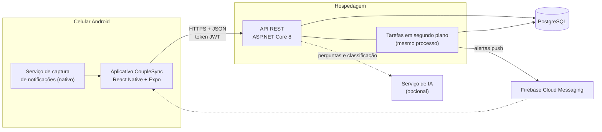
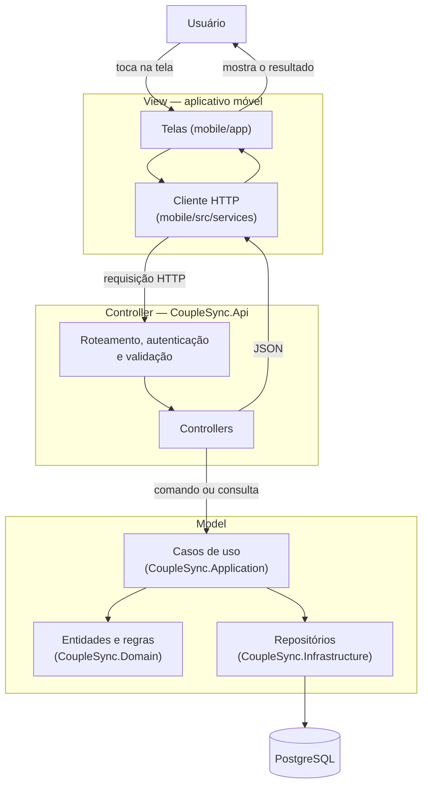
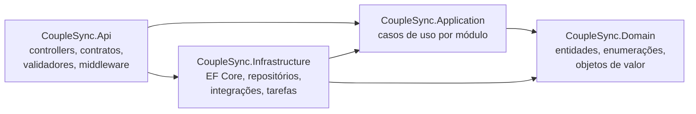
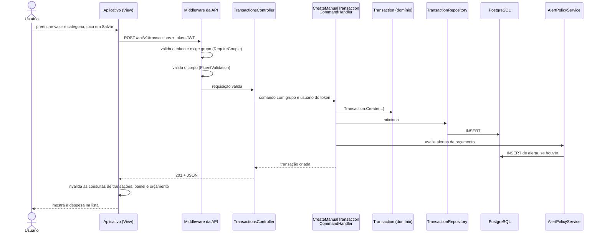
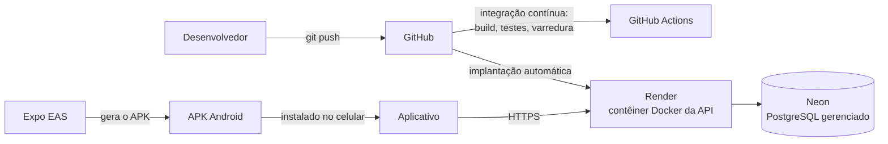

# 5. Arquitetura

## 5.1 Visão geral

O CoupleSync é um sistema cliente-servidor com três partes:

- um **aplicativo Android** (React Native com Expo), que é toda a interface com o usuário;
- uma **API REST** (ASP.NET Core em .NET 8), que concentra as regras de negócio;
- um **banco de dados PostgreSQL**, acessado somente pela API.

A API é um monólito modular: uma única aplicação implantável, organizada internamente em módulos de negócio (autenticação, grupo, transações, orçamento, metas, rendas, importação de extrato, alertas, relatórios). A escolha está registrada no [ADR-0001](../adr/0001-monolito-modular.md): para um piloto de até dez usuários e um único desenvolvedor, microsserviços trariam custo de operação sem benefício.

## 5.2 Tecnologias

| Camada | Tecnologia | Papel |
|---|---|---|
| Aplicativo | React Native 0.76, Expo SDK 52, TypeScript | Interface |
| | Expo Router | Navegação por arquivos |
| | TanStack Query | Leitura e cache dos dados do servidor |
| | Zustand | Estado local (sessão, período do painel) |
| | Axios | Cliente HTTP, com renovação de sessão |
| | Expo SecureStore | Guarda dos tokens em armazenamento cifrado do aparelho |
| | Kotlin (`NotificationListenerService`) | Captura de notificações bancárias |
| API | C# 12, ASP.NET Core 8 | Controladores e pipeline HTTP |
| | FluentValidation | Validação das requisições |
| | Entity Framework Core 8 + Npgsql | Persistência e migrations |
| | JWT Bearer, BCrypt.Net | Autenticação e hash de senha |
| | PdfPig | Extração de texto de extratos em PDF |
| | Firebase Admin SDK | Envio de notificações push |
| Banco | PostgreSQL 16 | Armazenamento |
| Testes | xUnit, `WebApplicationFactory`, SQLite em memória; Jest no aplicativo | Testes unitários e de integração |
| Entrega | Docker, GitHub Actions | Empacotamento e integração contínua |

## 5.3 O padrão MVC neste sistema

O material da disciplina recomenda a construção em camadas com o padrão MVC (Model, View, Controller). O MVC clássico descreve uma aplicação web que devolve HTML: o controlador recebe a requisição, consulta o modelo e escolhe uma visão para renderizar.

O CoupleSync separa as mesmas três responsabilidades, com uma diferença: a visão não está no servidor. A API devolve dados em JSON e quem desenha as telas é o aplicativo. A correspondência é esta:

| Papel no MVC | Onde está no CoupleSync | Responsabilidade |
|---|---|---|
| **Model** | `CoupleSync.Domain` (entidades e regras), `CoupleSync.Application` (casos de uso) e `CoupleSync.Infrastructure` (persistência) | Representar os dados do negócio, validar as regras e guardar o estado |
| **Controller** | `CoupleSync.Api/Controllers` | Receber a requisição HTTP, identificar o usuário e o grupo, acionar o caso de uso e devolver a resposta |
| **View** | Aplicativo móvel (`mobile/app` e `mobile/src`) | Apresentar os dados e capturar as ações do usuário |

No aplicativo, a mesma separação se repete em escala menor: os componentes de tela são a visão, os *hooks* de consulta e mutação fazem o papel de controlador, e o cache do TanStack Query mais os *stores* do Zustand são o modelo local. Quando uma ação altera dados, o aplicativo invalida as consultas afetadas e as telas que as observam se atualizam sozinhas, que é o comportamento descrito no material: o controlador atualiza o modelo e a visão reage à mudança.

## 5.4 Organização do código da API

A solução `backend/CoupleSync.sln` tem quatro projetos. As setas indicam "depende de".

| Projeto | Conteúdo | Depende de |
|---|---|---|
| `CoupleSync.Domain` | 14 entidades com suas invariantes, enumerações, objeto de valor `EmailAddress` | Nada |
| `CoupleSync.Application` | Um diretório por módulo (`Auth`, `Couple`, `Transactions`, `Budget`, `Goals`, `Income`, `OcrImport`, `Notification`, `NotificationCapture`, `Dashboard`, `Reports`, `CashFlow`, `AiChat`), com comandos, consultas e serviços; interfaces dos repositórios | `Domain` |
| `CoupleSync.Infrastructure` | `AppDbContext` e migrations, repositórios, segurança (JWT, bcrypt, gerador de código de convite), integrações (Firebase, leitor de PDF, IA), tarefas em segundo plano | `Application`, `Domain` |
| `CoupleSync.Api` | 14 controllers, contratos de requisição e resposta, validadores, filtro `RequireCouple`, tratamento global de erros, verificações de saúde | `Application`, `Infrastructure` |

O domínio não conhece banco nem HTTP. A infraestrutura implementa as interfaces que a aplicação declara, de modo que os casos de uso podem ser testados com repositórios falsos escritos à mão, sem banco.

### Um desvio assumido

A camada de aplicação referencia o pacote do Entity Framework Core. Alguns casos de uso consultam `DbSet` diretamente por uma interface (`IQueryDbContext`) em vez de passar por um repositório, e alguns tratam a exceção de violação de unicidade do banco. Isso significa que a aplicação não é independente da tecnologia de persistência, como uma arquitetura em camadas estrita exigiria.

Foi uma troca consciente por menos código em consultas simples de leitura. O custo é que trocar o EF Core por outra tecnologia exigiria mexer na camada de aplicação. A correção (mover essas consultas para repositórios) está registrada como pendência no laudo de qualidade.

## 5.5 O caminho de uma requisição

Exemplo: o usuário lança uma despesa manual (`POST /api/v1/transactions`).

Pontos a notar:

1. O grupo e o usuário nunca vêm do corpo da requisição. Vêm das declarações do token, que só o servidor emite.
2. Uma requisição inválida é recusada antes de chegar ao controlador.
3. A avaliação de alertas acontece depois de a despesa estar gravada; se falhar, a despesa não é desfeita.
4. O envio do alerta ao celular é feito depois, por uma tarefa em segundo plano, para não atrasar a resposta.

## 5.6 Decisões de arquitetura

As decisões estão registradas como ADRs em [`docs/adr`](../adr/README.md). As que mais moldam o sistema:

| Decisão | Motivo | Consequência |
|---|---|---|
| Monólito modular ([ADR-0001](../adr/0001-monolito-modular.md)) | Um desenvolvedor, poucos usuários | Uma única implantação; os módulos compartilham banco |
| Isolamento por grupo em três níveis ([ADR-0002](../adr/0002-autorizacao-por-casal.md)) | Dados financeiros de um grupo não podem vazar para outro | O identificador do grupo vai no token; o filtro `RequireCouple` barra quem não tem grupo; os repositórios filtram por grupo; um filtro global do EF Core serve de rede de segurança |
| Tarefas em segundo plano no mesmo processo ([ADR-0003](../adr/0003-jobs-em-processo.md)) | Evitar um serviço de fila | Simples de operar; uma tarefa interrompida por reinício do processo precisa ser retomada |
| Captura de notificações em vez de integração bancária ([ADR-0004](../adr/0004-captura-de-notificacoes-android.md)) | Sem custo, sem credenciais bancárias | Só Android; sem histórico retroativo; exige cuidado de privacidade |
| Leitura de extrato local, sem serviço externo ([ADR-0007](../adr/0007-parser-local-de-pdf.md)) | Custo zero e o extrato não sai do servidor | Um leitor por banco; só PDF com texto |
| Autenticação sem estado com JWT curto e token de renovação | A API não guarda sessão em memória | Token de acesso de 15 minutos; token de renovação de 7 dias, trocado a cada uso e guardado só como hash |

## 5.7 Segurança

| Aspecto | Como é tratado |
|---|---|
| Senhas | Hash bcrypt de custo 11; a senha nunca é gravada nem registrada em log |
| Sessão | JWT assinado com HMAC-SHA256; o segredo vem de variável de ambiente e a API se recusa a iniciar sem ele |
| Autorização | Todo controlador de dados exige usuário autenticado e pertencente a um grupo |
| Isolamento | Toda consulta é filtrada pelo grupo do token; acesso a recurso de outro grupo responde 404 |
| Força bruta | Limite de tentativas por minuto em login, cadastro e entrada em grupo |
| Envio de arquivos | Limite de 10 MB, tipo verificado pelo conteúdo, nome de arquivo gerado pelo servidor |
| Erros | Resposta genérica para falhas internas, sem detalhes da implementação |
| Segredos | Nenhum segredo no repositório; varredura automática na integração contínua |

As limitações conhecidas de segurança (não há como sair de um grupo ou trocar o código de convite; não há recuperação de senha) estão no laudo de qualidade.

## 5.8 Implantação

| Componente | Onde roda | Observação |
|---|---|---|
| API | Render, plano gratuito, a partir de `backend/Dockerfile` | Suspende após 15 minutos sem uso; as migrations são aplicadas na inicialização |
| Banco | Neon, PostgreSQL gerenciado, plano gratuito | |
| Aplicativo | APK gerado pelo Expo EAS e distribuído por arquivo | Não publicado em loja |
| Ambiente local | `docker compose up` sobe API e PostgreSQL | Ver o [README](../../README.md) |

A imagem Docker é construída em dois estágios, roda com usuário sem privilégios e expõe verificações de saúde em `/health/live` e `/health/ready`.
