# 6. Interface e experiência do usuário

Este documento descreve a interface do aplicativo CoupleSync: quem a usa, como as telas se organizam, e como cada princípio de projeto de interface apresentado no material da disciplina aparece nela. Para cada princípio há exemplos tirados do código e também os pontos em que a interface ainda o descumpre.

## 6.1 Para quem a interface foi desenhada

| Característica do usuário | Consequência no desenho |
|---|---|
| Usa o celular com uma mão, em pé, entre outras tarefas | Ações frequentes ao alcance do polegar; lançamento de despesa com um único campo obrigatório |
| Não é da área financeira | Vocabulário do dia a dia ("gastos", "metas", "rendas"), sem termos contábeis |
| Abre o aplicativo para uma pergunta rápida | A primeira tela responde "quanto gastamos este mês" sem nenhum toque |
| Divide o aplicativo com outra pessoa | Cada despesa mostra quem lançou; o painel separa o gasto por membro |
| Desiste se registrar gasto der trabalho | Três formas de entrada, duas delas quase sem digitação |

## 6.2 Arquitetura da informação

O aplicativo tem duas áreas. A área de acesso (entrar, criar conta, formar o grupo) só aparece para quem ainda não está identificado ou não tem grupo. A área principal é organizada em abas na parte inferior da tela, cada uma respondendo a uma pergunta do usuário.

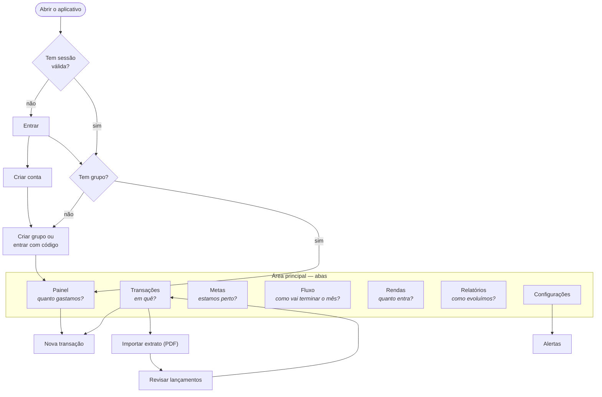

### Telas

| Tela | Rota | O que o usuário faz nela |
|---|---|---|
| Entrar | `/login` | Informa e-mail e senha |
| Criar conta | `/register` | Informa nome, e-mail e senha |
| Grupo | `/couple-setup` | Cria um grupo e recebe o código de convite, ou entra em um grupo com o código |
| Painel | `/` | Vê o total do mês, a divisão por membro e por categoria |
| Transações | `/transactions` | Lista as despesas, troca a categoria, exclui, ativa a captura de notificações |
| Nova transação | `/transactions/new` | Lança uma despesa à mão |
| Importar extrato | `/ocr-upload` | Escolhe o PDF do extrato e acompanha o processamento |
| Revisar lançamentos | `/ocr-review` | Confere, corrige e seleciona os lançamentos lidos do extrato |
| Metas | `/goals` | Cria, edita, acompanha e exclui metas |
| Fluxo | `/cashflow` | Vê o gasto médio diário e o total em 30 ou 90 dias |
| Rendas | `/budget` | Registra as fontes de renda, próprias e compartilhadas |
| Relatórios | `/reports` | Vê gastos por categoria, evolução mensal e progresso das metas |
| Assistente | `/chat` | Faz perguntas sobre as finanças do grupo (aba exibida só quando o recurso está habilitado) |
| Configurações | `/settings` | Acessa as permissões de notificação, os alertas e a saída da conta |
| Alertas | `/settings/alerts` | Liga e desliga cada tipo de alerta |

### Capturas de tela

Capturas do aplicativo em execução (APK de `preview` em emulador com Android 14, conectado à API publicada), com as contas de demonstração e dados fictícios.

<table>
<tr>
<td align="center">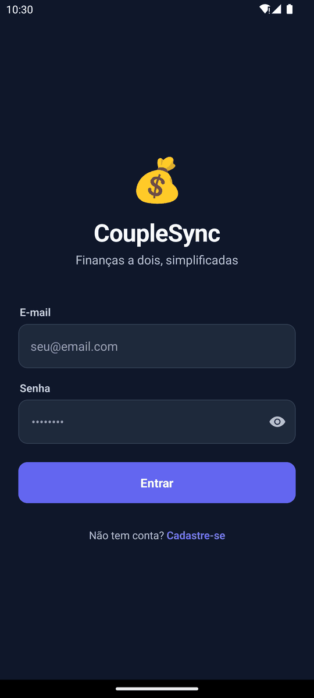 Entrar</td>
<td align="center">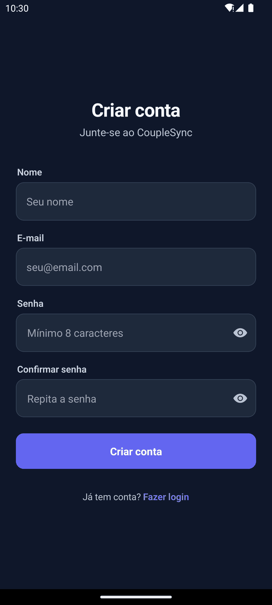 Criar conta</td>
<td align="center"> Grupo</td>
</tr>
<tr>
<td align="center">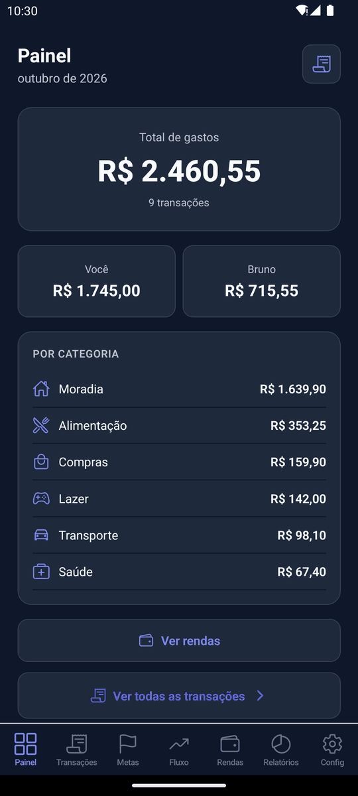 Painel</td>
<td align="center">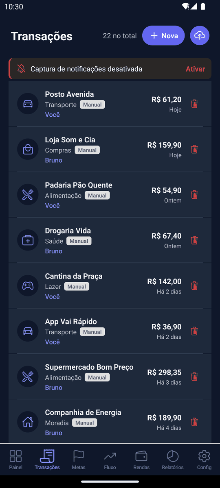 Transações</td>
<td align="center">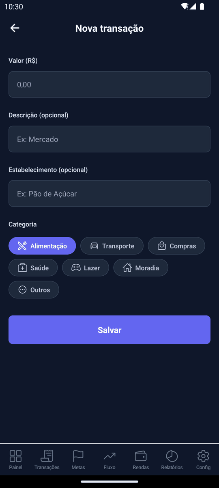 Nova transação</td>
</tr>
<tr>
<td align="center">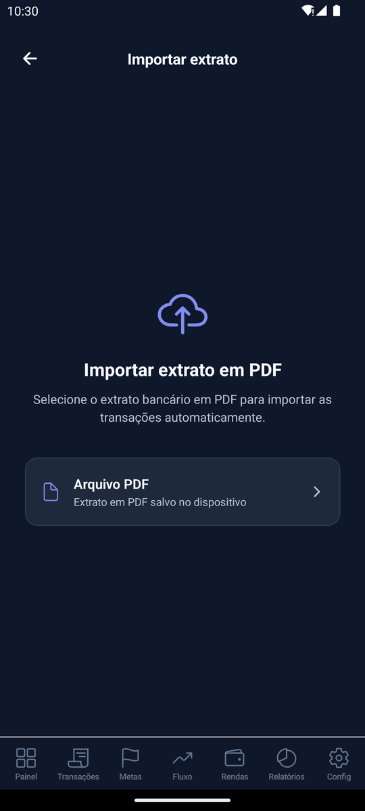 Importar extrato</td>
<td align="center">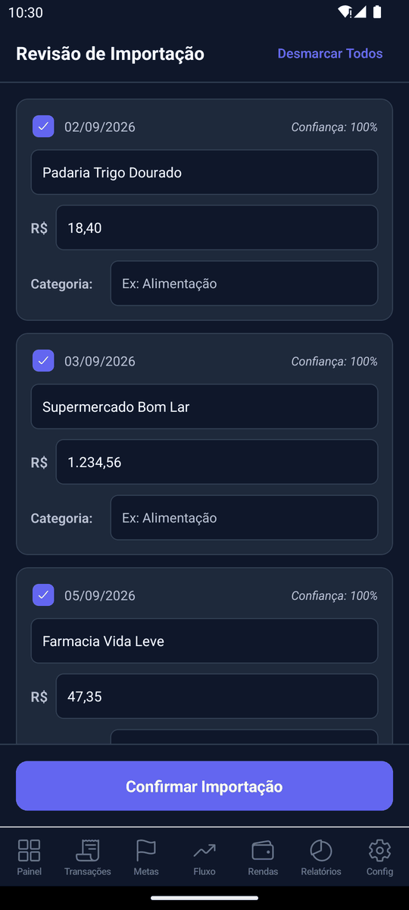 Revisar lançamentos</td>
<td align="center">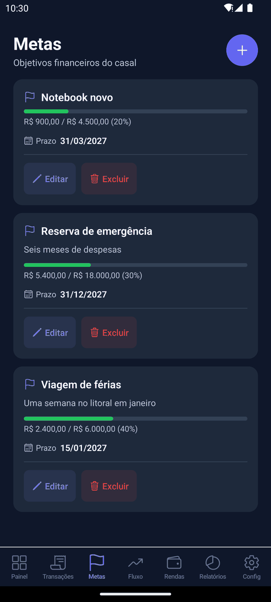 Metas</td>
</tr>
<tr>
<td align="center">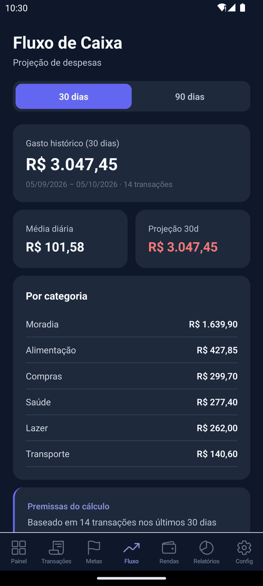 Fluxo</td>
<td align="center">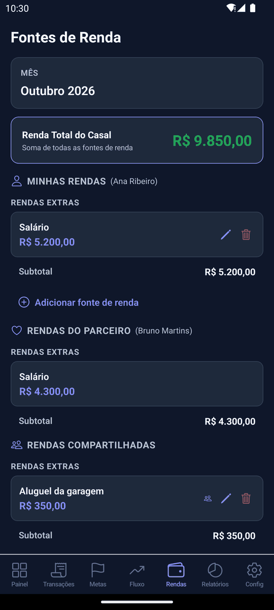 Rendas</td>
<td align="center">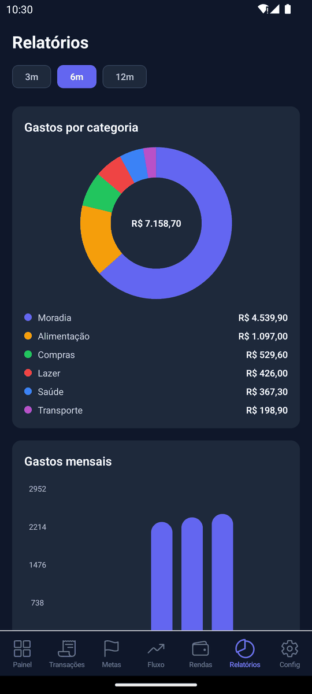 Relatórios</td>
</tr>
<tr>
<td align="center">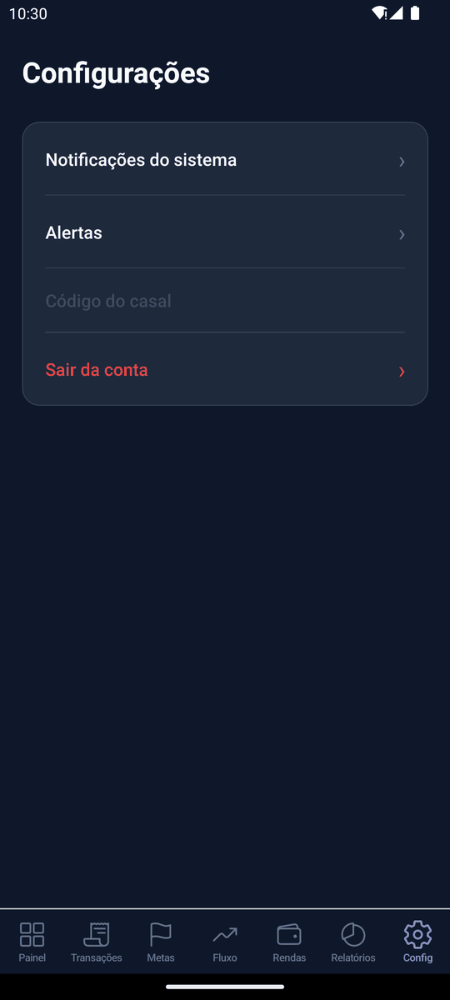 Configurações</td>
<td align="center">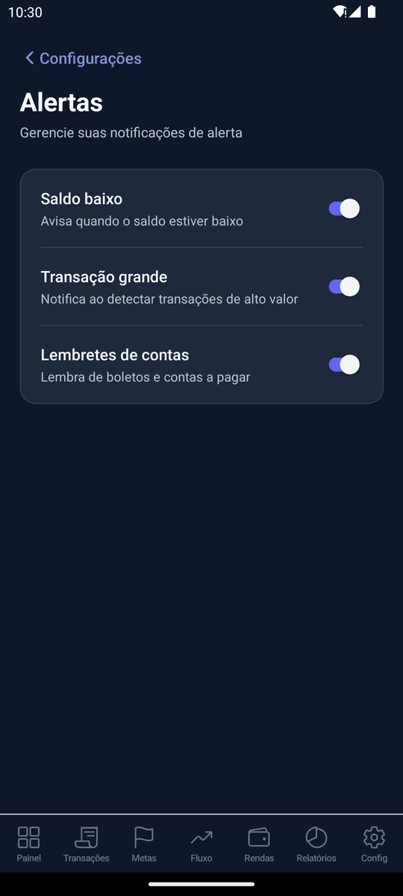 Alertas</td>
</tr>
</table>

### Elementos de interface usados

| Categoria (material da disciplina) | Elementos no aplicativo |
|---|---|
| Controles de entrada | Campos de texto com máscara de valor e de data, botões, seletor de categoria em grade, caixas de seleção na revisão do extrato, interruptores nos alertas, seletor de arquivo |
| Componentes de navegação | Barra de abas inferior com ícone e rótulo, botão de voltar, abas internas (30 e 90 dias no fluxo de caixa; 3, 6 e 12 meses nos relatórios) |
| Componentes informativos | Avisos temporários (*toasts*) de sucesso, erro e alerta; indicadores de carregamento com texto; barras de progresso nas metas; diálogos de confirmação; selos de origem da despesa; notificações push |
| Recipientes | Cartões para cada despesa, meta e fonte de renda; janelas modais para criar e editar |

## 6.3 Identidade visual

A interface usa um tema escuro único, definido em um só arquivo (`mobile/src/theme/index.ts`) e reutilizado pelas telas.

| Elemento | Valor | Uso |
|---|---|---|
| Fundo | `#0F172A` | Fundo de todas as telas |
| Superfície | `#1E293B` | Cartões, campos, barra de abas |
| Primária | `#6366F1` e `#818CF8` | Botões principais, aba ativa, destaques |
| Texto | `#F8FAFC` | Texto principal (contraste de 17:1 sobre o fundo) |
| Texto secundário | `#B8C2D1` | Legendas e apoio (contraste de 9,9:1) |
| Sucesso, alerta, erro | `#22C55E`, `#F59E0B`, `#EF4444` | Cores com significado fixo em todo o aplicativo |
| Espaçamento | 4, 8, 16, 24, 32, 48 | Escala em múltiplos de 4 |
| Tipografia | 11, 12, 14, 16, 18, 22, 28 | Sete tamanhos; título em 28, corpo em 14 e 16 |
| Cantos | 8 e 12 | Cartões e campos arredondados |
| Ícones | Ionicons de contorno | Um único conjunto em todo o aplicativo |

A cor é usada de forma estratégica: a primária marca o que é acionável, e verde, amarelo e vermelho ficam reservados a estado (dentro do orçamento, perto do limite, estourado).

## 6.4 Os princípios de interface, aplicados

O material da disciplina lista oito qualidades de uma boa interface. Para cada uma, o que o aplicativo faz e onde ainda falha.

### Clara

- Todo campo tem rótulo acima e um exemplo dentro ("Ex: Mercado", "Ex: Viagem para Europa").
- As mensagens de erro do login distinguem a causa: credenciais erradas, servidor indisponível, sem conexão, tempo esgotado.
- Na importação de extrato, cada falha tem uma mensagem própria que diz o que fazer: "O PDF está protegido por senha. Por enquanto, exporte o extrato sem senha e tente novamente."
- Listas vazias explicam o próximo passo em vez de ficarem em branco.
- Cada despesa mostra quem lançou e de onde veio (manual, extrato ou notificação), e o painel separa os gastos pelo nome de cada membro.

**Onde falha:** a aba "Rendas" abre uma tela chamada "Fontes de Renda" cuja rota interna é `budget`; resta um rótulo abreviado ("Config") e siglas nos períodos dos relatórios ("3m", "6m", "12m"); o item "Notificações do sistema" não deixa claro que se trata da captura de notificações bancárias.

### Consistente

- Cores, espaçamentos e tamanhos de fonte vêm de um tema central.
- Os estados de carregando, vazio e erro são componentes compartilhados (`LoadingState`, `EmptyState`, `ErrorState`), então se comportam igual em telas diferentes.
- Cada categoria tem sempre o mesmo ícone e o mesmo nome, em todas as telas, qualquer que seja a grafia devolvida pela API.
- Excluir uma despesa, uma meta ou uma fonte de renda segue a mesma sequência: toque, diálogo de confirmação com "Cancelar", ação destrutiva em vermelho.

**Onde falha:** as telas maiores ainda usam medidas escritas à mão em vez das do tema; erros aparecem ora em diálogo, ora em aviso temporário; há dois estilos de campo de valor (com máscara de centavos e em texto livre).

### Simples

- Do cadastro ao painel são três passos: criar conta, formar o grupo, usar.
- O lançamento manual tem um único campo obrigatório, o valor; a categoria já vem selecionada.
- O formulário de nova renda fica recolhido até o usuário pedir.
- Valor e data são formatados enquanto o usuário digita.
- A importação de extrato oferece apenas o que funciona: seleção de arquivo PDF.

**Onde falha:** a barra inferior tem sete abas, acima das três a cinco recomendadas para navegação inferior; o lançamento manual não permite escolher a data; o painel não tem seletor de mês.

### Controlada pelo usuário

- Nada é gravado sem uma ação explícita. Os lançamentos lidos de um extrato passam por uma tela de revisão, em que o usuário seleciona item a item, ou todos de uma vez, e corrige descrição, valor e categoria antes de confirmar.
- O usuário pode puxar a tela para atualizar os dados.
- Janelas modais fecham pelo botão, pelo toque fora e pelo botão de voltar do Android.
- Sair da conta pede confirmação.
- A captura de notificações bancárias só funciona depois que o usuário concede a permissão nas configurações do Android, e pode ser revogada no mesmo lugar.

**Onde falha:** não há botão para cancelar o processamento de um extrato depois do envio; a captura de notificações não tem um interruptor dentro do próprio aplicativo.

### Direta

- Trocar a categoria de uma despesa atualiza na hora a lista e o total por categoria no painel.
- Excluir uma despesa atualiza a lista, o painel e os relatórios.
- Confirmar a importação de um extrato leva o usuário de volta à lista, já com os novos lançamentos.
- Puxar a tela para baixo recarrega os dados, com o indicador visível enquanto a consulta acontece.

**Onde falha:** o aplicativo não tem tela para vincular uma despesa a uma meta (a API oferece a operação); o progresso exibido na lista de metas usa só o valor informado à mão (pendência registrada no laudo).

### Empática e reversível

- Toda exclusão pede confirmação, e a de meta avisa que não pode ser desfeita.
- Cancelar a edição de uma renda restaura os valores anteriores.
- A categoria de uma despesa pode ser trocada a qualquer momento.
- Ao alternar um alerta, a interface muda na hora e volta ao estado anterior se o servidor recusar.
- Lançamentos que o sistema suspeita serem repetidos aparecem destacados na revisão do extrato, para o usuário decidir se mantém.

**Onde falha:** não existe "desfazer" depois de excluir; não é possível corrigir o valor ou a data de uma despesa já gravada (só a categoria); tocar fora do formulário de meta descarta o que foi digitado, sem perguntar.

### Dá resposta

- Toda ação que vai ao servidor mostra um indicador dentro do botão, que fica desabilitado até a resposta.
- O carregamento tem texto que diz o que está acontecendo: "Enviando arquivo...", "Aguardando processamento...", "Processando extrato...".
- Avisos temporários confirmam o resultado, em verde, amarelo ou vermelho, e são anunciados por leitores de tela.
- Ações concluídas dão resposta tátil.
- Quando a sessão expira e não pode ser renovada, o usuário é avisado ("Sua sessão expirou. Entre novamente.") antes de voltar à tela de entrada.

**Onde falha:** criar, editar e excluir uma meta não mostram mensagem de sucesso; algumas mensagens de erro do servidor chegam em inglês.

### Esteticamente agradável

- Uma paleta só, escura, com uma cor de destaque.
- Hierarquia por tamanho e peso: um número grande por tela (o total do mês, o progresso da meta), com o resto em apoio.
- Cartões com borda sutil e cantos arredondados separam os itens sem linhas divisórias.
- Gráficos de rosca e de barras usam as cores do tema.

**Onde falha:** emojis são usados como logotipo e ilustração ao lado de ícones vetoriais; os selos de origem das despesas usam tons claros que destoam do tema escuro.

## 6.5 Padrões que reduzem o esforço

O material recomenda antecipar o objetivo do usuário e oferecer valores já preenchidos. No aplicativo:

- a moeda é sempre o real e a data de uma despesa manual é o momento do lançamento;
- a categoria de uma despesa capturada ou importada é sugerida por regras de palavra-chave (um gasto em "UBER" entra como Transporte);
- o orçamento do mês é criado automaticamente na primeira vez que o usuário informa a renda;
- os três tipos de alerta vêm ligados;
- na revisão do extrato, todos os lançamentos vêm selecionados, e os suspeitos de repetição vêm destacados para o usuário decidir.

## 6.6 Acessibilidade

| Aspecto | Situação |
|---|---|
| Rótulos para leitor de tela | 51 elementos rotulados em 12 arquivos; itens de lista anunciam nome e valor |
| Papéis e estados | Abas, caixas de seleção e seleção de categoria declaram papel e estado; avisos temporários são anunciados |
| Contraste | Texto principal 17:1 e secundário 9,9:1, acima do mínimo de 4,5:1 da WCAG AA |
| Área de toque | Botões principais com 48 dp |
| **Pendências** | Texto desabilitado e texto na cor primária ficam abaixo de 4,5:1; alguns botões secundários têm de 26 a 36 dp; campos da tela de entrada, interruptores de alerta e botões de voltar não têm rótulo; prazo vencido é indicado só por cor; não há tema claro nem adaptação a fonte ampliada |

## 6.7 Privacidade e LGPD

O aplicativo trata dados financeiros pessoais, e uma de suas funções lê notificações de outros aplicativos. Esta seção descreve exatamente o que acontece com esses dados.

### Captura de notificações bancárias

| Pergunta | Resposta |
|---|---|
| De quais aplicativos lê? | Somente de uma lista fixa de nove pacotes de cinco bancos: Nubank, Itaú, Inter, C6 e Bradesco. Notificações de qualquer outro aplicativo são descartadas no código nativo, antes de chegar ao restante do aplicativo |
| O que extrai? | Valor, estabelecimento e data, por expressões regulares específicas de cada banco, no próprio aparelho |
| O que considera despesa? | Somente notificações de compra, pagamento ou transferência enviada. Recebimentos, avisos de fatura e de limite são descartados |
| O que sai do aparelho? | Banco, valor, moeda, data e hora, e estabelecimento. O texto da notificação não é enviado |
| Fica algo gravado no aparelho? | Não. Os eventos ficam em memória até o envio |
| Quem vê a despesa? | Todos os membros do grupo |
| Como é autorizada? | Pela permissão de acesso a notificações do Android, concedida pelo usuário nas configurações do sistema |
| Como é desligada? | Revogando a mesma permissão |

### Outros dados

| Dado | Tratamento |
|---|---|
| Senha | Nunca armazenada; o servidor guarda só o hash |
| Tokens de sessão | Guardados no armazenamento cifrado do aparelho |
| Extrato em PDF | Enviado ao servidor, processado ali mesmo e apagado após a leitura; não é enviado a terceiros na configuração padrão |
| Assistente de perguntas | Quando habilitado, envia a um serviço externo de IA os totais de renda, orçamento, gastos por categoria e metas do grupo, sem nome nem e-mail |
| Notificações push | Enviadas pelo Firebase Cloud Messaging, que recebe o identificador do aparelho e o texto do alerta |

### O que falta para uso com público real

O aplicativo é um piloto e foi testado com dados de teste. Antes de ser distribuído a usuários reais, precisa de itens que a Lei Geral de Proteção de Dados e a política da Google Play exigem e que ainda não existem:

- uma tela que explique, antes do pedido de permissão, o que é lido e para onde vai, com aceite registrado;
- uma política de privacidade publicada;
- um interruptor da captura dentro do aplicativo;
- uma forma de o usuário exportar e apagar os próprios dados;
- um aviso, na tela do assistente, de que os dados são enviados a um serviço de IA.

Esses itens estão registrados como pendência no laudo de qualidade.
