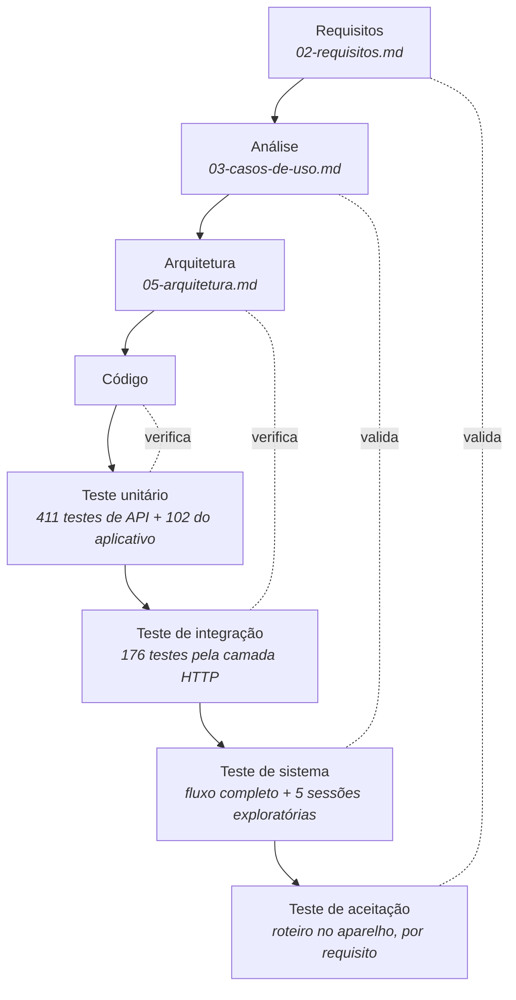

# 7. Plano de testes

## 7.1 Verificação e validação

O material da disciplina distingue duas atividades que costumam ser confundidas:

- **Verificação** pergunta "estamos construindo o produto do jeito certo?". Acontece durante o desenvolvimento e confere o software contra a especificação: revisões de código, inspeções e os testes que o próprio desenvolvedor escreve.
- **Validação** pergunta "construímos o produto certo?". Acontece com um módulo ou o sistema já pronto e confere se ele atende a quem vai usá-lo, sem se importar com o caminho percorrido.

Neste projeto as duas atividades usam meios diferentes:

| Atividade | O que foi feito | Onde está registrado |
|---|---|---|
| Verificação | Testes unitários e de integração automatizados, executados a cada alteração | `backend/tests`, `mobile/src/**/__tests__` |
| Verificação | Revisão de código completa, em cinco frentes (segurança, arquitetura e dados, testes, aplicativo, infraestrutura) | [Laudo de qualidade](08-laudo-de-qualidade.md), seção de método |
| Verificação | Compilação com tipagem estrita no aplicativo e análise estática na integração contínua | `.github/workflows/ci.yml` |
| Validação | Cinco sessões de teste exploratório contra o sistema em execução, com 642 casos, repetidas depois das correções | [Laudo de qualidade](08-laudo-de-qualidade.md) |
| Validação | Roteiro manual no aparelho para cada correção do aplicativo | [Laudo de qualidade](08-laudo-de-qualidade.md), anexo |

## 7.2 O Modelo V aplicado ao projeto

No Modelo V, cada etapa de construção (lado esquerdo) tem um nível de teste correspondente (lado direito), planejado junto com ela.



| Nível | O que confere | Como é feito aqui |
|---|---|---|
| **Unitário** ↔ código | Uma classe ou função isolada faz o que deveria | xUnit na API, com repositórios falsos escritos à mão; Jest no aplicativo, para a lógica extraída das telas |
| **Integração** ↔ arquitetura | As camadas funcionam juntas: rota, autenticação, validação, caso de uso, persistência | xUnit com `WebApplicationFactory`: cada teste sobe a API inteira em memória e faz requisições HTTP reais contra um banco SQLite |
| **Sistema** ↔ análise | Os casos de uso funcionam de ponta a ponta no sistema montado | Um teste automatizado percorre o fluxo do piloto (dois usuários, grupo, notificação, meta, painel); cinco sessões exploratórias exercitam a API em Docker com PostgreSQL |
| **Aceitação** ↔ requisitos | O sistema atende a necessidade de quem usa | Roteiro passo a passo no aparelho; fichas de teste do laudo |

## 7.3 Ferramentas

| Ferramenta | Uso |
|---|---|
| xUnit 2 | Testes unitários e de integração da API |
| `Microsoft.AspNetCore.Mvc.Testing` | Sobe a API em memória para os testes de integração |
| SQLite em memória | Banco dos testes de integração, criado a cada teste |
| Coverlet | Medição de cobertura |
| Jest + ts-jest | Testes unitários do aplicativo |
| TypeScript (`tsc --noEmit`, modo estrito) | Verificação de tipos do aplicativo |
| Maestro | Quatro fluxos de interface do aplicativo (abertura, entrada, navegação, painel) |
| `curl` + scripts de shell | Sessões de teste exploratório, reexecutáveis |
| GitHub Actions | Executa build, testes, varredura de segredos e build da imagem a cada envio |

## 7.4 Como executar

```bash
# API: todos os testes (cerca de um minuto)
dotnet test backend/CoupleSync.sln

# API: com relatório de cobertura
dotnet test backend/CoupleSync.sln --collect:"XPlat Code Coverage"

# API: um módulo
dotnet test backend/CoupleSync.sln --filter "FullyQualifiedName~Goals"

# Aplicativo
cd mobile
npm test
npx tsc --noEmit
```

Os testes da API não precisam de banco instalado nem de rede: o banco é substituído por SQLite em memória e os serviços externos (IA, leitura de PDF por serviço, armazenamento) por implementações falsas.

## 7.5 Inventário dos testes

Situação em 05/10/2026, depois do ciclo de correções: **588 testes na API e 102 no aplicativo, todos aprovados.**

| Projeto | Testes | Duração |
|---|---|---|
| `CoupleSync.UnitTests` | 411 | 1 s |
| `CoupleSync.IntegrationTests` | 176 | 50 s |
| `CoupleSync.E2ETests` (fluxo completo em processo) | 1 | 4 s |
| Aplicativo (Jest, 5 suítes) | 102 | 2 s |

### Cobertura da API

Medida com Coverlet, unindo os três projetos de teste e excluindo o código gerado das migrations.

| Projeto | Linhas | Ramos |
|---|---|---|
| `CoupleSync.Api` | 89,9% | 62,7% |
| `CoupleSync.Application` | 88,8% | 82,5% |
| `CoupleSync.Domain` | 90,2% | 68,7% |
| `CoupleSync.Infrastructure` | 71,5% | 55,0% |
| **Total** | **83,8%** | **68,4%** |

Antes do ciclo de correções a cobertura era de 77,9% das linhas e 63,5% dos ramos, com 458 testes.

O aplicativo não tem medição de cobertura: os testes cobrem a lógica extraída para módulos puros (renovação de sessão, leitura de notificações, montagem das requisições), não as telas.

## 7.6 Matriz de rastreabilidade

Cada linha liga um grupo de requisitos aos testes automatizados que o verificam. Os diretórios são relativos a `backend/tests/`; `U` é `CoupleSync.UnitTests` e `I` é `CoupleSync.IntegrationTests`.

| Requisitos | O que é testado | Onde |
|---|---|---|
| RF01, RF02, RF03, RN05, RN06, RNF05 | Cadastro, login, e-mail repetido, rotação e reuso do token de renovação | `U/Auth`, `I/AuthIntegrationSmokeTests.cs` |
| RF03 (aplicativo) | Um 401 dispara uma única renovação, mesmo com várias requisições simultâneas; renovação recusada encerra a sessão | `mobile/src/services/__tests__/authRefresh.test.ts` |
| RF04, RF05, RF06, RN03, RN04 | Criar grupo, entrar com código, terceiro membro, usuário que já tem grupo | `U/Couples`, `I/CoupleIntegrationSmokeTests.cs` |
| RN01, RN02, RNF03 | Usuário sem grupo recebe 403; um grupo não lê nem altera dados de outro | `I/Authorization` e os testes de isolamento de cada módulo em `I/` |
| RNF02 | A API recusa iniciar sem segredo, com segredo curto ou com o valor de exemplo | `I/Security/JwtSecretStartupTests.cs` |
| RNF04 | O 6º login, o 6º cadastro e a 6ª entrada em grupo em um minuto recebem 429; a renovação de sessão não é limitada | `I/Security/RateLimitingIntegrationTests.cs` |
| RF10, RF14, RF15, RF16, RN09 | Lançar, listar, filtrar, recategorizar e excluir despesas | `U/Transactions`, `I/Transactions` |
| RF11, RF17, RN07 | Entrada de evento de notificação, classificação por regra, duplicidade | `U/NotificationCapture`, `U/Security`, `I/NotificationCapture` |
| RF11, RN08 (aplicativo) | Para cada um dos cinco bancos: compra reconhecida; recebimento, fatura, limite e propaganda descartados | `mobile/src/modules/integrations/notification-capture/__tests__/notificationParser.test.ts` |
| RNF16 | O corpo enviado ao servidor não contém o texto da notificação | `mobile/.../__tests__/ingestRequest.test.ts` |
| RF12, RN18 | Leitores de extrato por banco, detecção de banco, falhas de arquivo, tentativas da tarefa em segundo plano | `U/OcrImport`, `I/OcrImport` |
| RF13, RN10, RN11 | Confirmação com linhas repetidas, reimportação, índice inexistente, correções de valor e descrição | `U/OcrImport/ImportJobConfirmTests.cs`, `ImportJobCandidateEditsTests.cs`, `I/OcrImport/OcrConfirmIntegrationTests.cs` |
| RF13 (aplicativo) | Só as linhas alteradas e selecionadas viram correção; valor em formato brasileiro | `mobile/src/modules/ocr/__tests__/confirmRequest.test.ts` |
| RF20, RF21, RF22, RN12 | Plano do mês, alocações, limite de 20, categoria repetida, gasto contra planejado | `U/Budget`, `I/Budget` |
| RF23, RF24, RN13 | Rendas individuais e compartilhadas; total em grupo com três membros | `U/Income`, `I/Income` |
| RF30 a RF33, RN14, RN15 | Criar, editar só o valor guardado, arquivar, progresso | `U/Goals`, `I/Goals` |
| RF34, RN16 | Vínculo de despesa a meta, inclusive de outro grupo | `I/Goals`, `I/Transactions` |
| RF40, RF43 | Painel por período, fluxo de caixa | `U/Dashboard`, `U/CashFlow`, `I/Dashboard`, `I/CashFlow` |
| RF50, RF51, RF52, RN17 | Regras de alerta; alertas para quem não gravou preferências | `U/Notifications` |
| RF53, RF54 | Preferências de alerta, registro de aparelho, envio | `U/Notifications`, `I/Notifications` |
| RF60 | Assistente: contexto, limite de uso, validação | `U/AiChat`, `I/AiChat` |
| RNF06 | Limites de texto e de valor, datas com fuso, erros de domínio convertidos em 400 | `U/Validation`, `I/Validation` |

### Requisitos sem teste automatizado

| Requisito | Motivo |
|---|---|
| RF41, RF42 (relatórios) | O controlador de relatórios não tem teste pela camada HTTP |
| RF23 (operações de criar, editar e excluir renda pela API) | Só o total em grupo tem teste de integração; as demais operações têm teste unitário do serviço |
| Telas do aplicativo | Os testes do aplicativo cobrem lógica, não componentes visuais |
| RNF01, RNF08, RNF09, RNF12 | Dependem do ambiente de hospedagem ou de avaliação manual |

## 7.7 Limitações do plano

Estas limitações estão registradas no laudo de qualidade e precisam ser lidas junto com os números acima.

1. **Os testes de integração rodam em SQLite, e a produção usa PostgreSQL.** As migrations não são executadas por nenhum teste, e consultas com caminho próprio para PostgreSQL (totais do painel e dos relatórios) só são exercitadas nas sessões exploratórias. Alguns defeitos corrigidos neste ciclo só se manifestavam no PostgreSQL; para eles, a evidência de "antes" é o log da sessão exploratória, não um teste automatizado falhando.
2. **O teste chamado "E2E" roda dentro do processo de teste.** Ele percorre o fluxo completo pela camada HTTP, mas não envolve o aplicativo nem o banco real.
3. **O aplicativo não foi testado de forma automatizada em aparelho.** Os quatro fluxos Maestro existentes cobrem só abertura, entrada e navegação, e o de entrada depende de identificadores que as telas ainda não têm.
4. **Os leitores de notificação e de extrato foram testados com textos e arquivos sintéticos**, não com dados reais de cada banco.
5. **Não há teste de carga nem de concorrência**, coerente com o porte do piloto.
